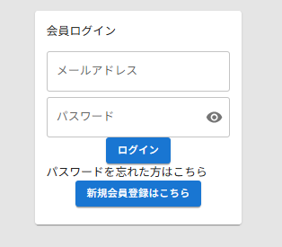
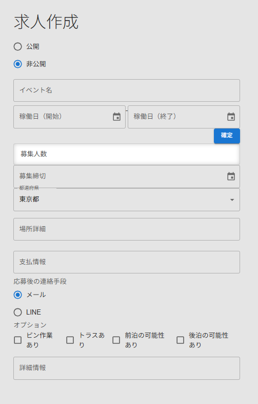
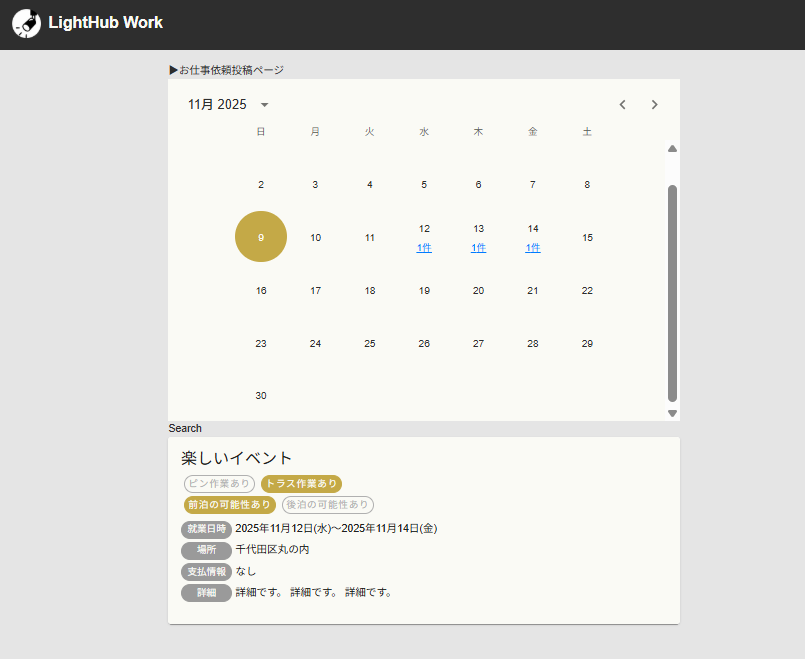

# 💡 Light Matching（照明スタッフ向けマッチングアプリ）

## 🏁 プロジェクト概要
照明スタッフや舞台制作スタッフなど、技術職人材と依頼側をつなぐマッチングアプリです。  
「現場ごとに柔軟な人材マッチング」をテーマに、業界特化型の求人・応募機能を提供します。

本プロジェクトは個人開発としてスタートし、**システム設計・上流工程の経験を意識的に積む**ことを目的としています。

---

## 🌐 デプロイ先（本番環境）
本番デプロイ先URL：[https://light-matching-frontend.vercel.app/](https://light-matching-frontend.vercel.app/login)

---

## 🧩 システム構成
| 項目 | 内容 |
|------|------|
| フロントエンド | Next.js (App Router, TypeScript) |
| バックエンド | Laravel + Fortify |
| 認証 | Laravel Sanctum（CookieベースSPA認証） |
| 通信 | Axios（`withCredentials` 有効） |
| データベース | MySQL（開発中はSQLite） |
| デプロイ想定 | Vercel（フロント）＋ AWS（API） |
| 状態管理 | React Context + Hooks |
| UI | シンプルなカスタムコンポーネント構成 |

📊 **構成図イメージ**
```
[ Next.js (Vercel) ]
        │
        ▼
[ Laravel API (AWS EC2) ]
        │
        ▼
     [ MySQL ]
```

---

## ⚙️ 技術選定の意図

| 技術 | 採用理由 |
|------|-----------|
| **Next.js App Router** | 最新構成でのSSR + SPAの共存を実践するため |
| **Laravel Fortify** | 認証機能を堅牢かつ最小実装で構築できる |
| **Sanctum** | SPAとのCookie認証連携を容易にするため |
| **Axios + ミドルウェア** | API通信とルーティング制御の責務を分離 |
| **TypeScript** | 型補完による保守性向上 |
| **AWS** | 商用レベルを意識したインフラ基盤の演習目的 |

---

## 🔐 認証とルーティングの仕組み

### 認証フロー
1. フロントから `/sanctum/csrf-cookie` を取得  
2. Fortify の `/login` でログイン → セッションCookieが保存される  
3. `/api/user` にアクセスしてログイン中ユーザーを取得  
4. Cookieによりセッション維持（リロード後も有効）

### ミドルウェア制御（`middleware.ts`）
- **未ログイン状態**で `/jobs` などにアクセス → `/login` にリダイレクト  
- **ログイン済み状態**で `/login` にアクセス → `/jobs` にリダイレクト  
- `src/middleware.ts` に配置（App Router準拠）

```ts
// middleware.ts（抜粋）
export function middleware(req: NextRequest) {
  const token = req.cookies.get("access_token")?.value;
  const { pathname } = req.nextUrl;

  if (!token && pathname.startsWith("/jobs")) {
    return NextResponse.redirect(new URL("/login", req.url));
  }
  if (token && pathname.startsWith("/login")) {
    return NextResponse.redirect(new URL("/jobs", req.url));
  }

  return NextResponse.next();
}
```

---

## 🧱 主要機能一覧

| 機能 | 状態 | 概要 |
|------|------|------|
| ログイン | ✅ 実装済 | Fortify + Sanctum 認証連携 |
| ログアウト | ✅ 実装済 | Cookie削除 + `/login` へ遷移 |
| 求人一覧 | ✅ MVP完成 | 認証済ユーザーのみアクセス可能 |
| 応募機能 | 🚧 実装予定 | 応募時にメッセージ送信 |
| 求人管理（企業側） | 🚧 今後実装 | CRUD・ステータス管理予定 |

---

## 🧠 コンポーネント / フック設計方針

| レイヤー | 役割 |
|-----------|------|
| `/app/` | ページ単位。Next.jsのルーティング制御 |
| `/features/` | 機能単位（ドメイン単位）でContext・Hooks・Utilsなどをまとめたフォルダ。 |
| `/services/` | API呼び出し層（Axios） |
| `/components/` | 再利用可能なUIパーツ |
| `/lib/` | Axiosクライアント設定・Cookie処理など共通関数 |


---

## 🚀 今後の開発計画
- [ ] 求人登録・編集機能（企業向け）
- [ ] 応募・採用ステータスの管理
- [ ] カレンダー検索・応募締切対応
- [ ] APIレスポンス型定義（TypeScriptとの整合性強化）
- [ ] テスト追加（Vitest / PHPUnit）
- [ ] README → 技術設計書へ発展

---

## ⚙️ 開発環境セットアップ手順

1. **リポジトリをクローン**

```bash
git clone https://github.com/koruri29/light-matching-frontend.git
cd light-matching-frontend
```

2. **環境変数を作成**

```bash
cp .env.example .env.local
```

必要に応じて、`NEXT_PUBLIC_API_URL` などの値をバックエンドに合わせて編集。

3. **パッケージをインストール**

```bash
pnpm install
# または
npm install
# または
yarn install
```

4. **開発サーバ起動**

```bash
pnpm dev
# または
npm run dev
# または
yarn dev
```

ブラウザで `http://localhost:3000` にアクセス可能。

---

## 🌟 初期操作

1. `http://localhost:3000/login` にアクセス  
2. デフォルトのアカウントでログイン (要API側セットアップ)
   - メール：`client1@example.com`  
   - パスワード：`password`  
3. 募集一覧ページに遷移  
4. 画面上部の「お仕事依頼投稿ページ」を押下  
5. 投稿ページで必要項目を入力して投稿  
6. 投稿後、`http://localhost:3000/jobs` に戻ると、一覧に反映されていることを確認

---

---

## 📷 スクリーンショット
- ログイン画面


- 応募フォーム


- 求人一覧画面


---

## 🗂️ フォルダ構成（抜粋）

```
src/
├── app/              # Next.js App Router構成（ページ・レイアウト）
│   ├── layout.tsx
│   ├── page.tsx
│   ├── login/
│   │   └── page.tsx
│   └── jobs/
│       └── page.tsx
├── components/       # 再利用可能なUIパーツ（MUIベース）
│   ├── Button.tsx
│   └── Header.tsx
├── features/         # ドメイン単位の状態管理やロジック
├── services/         # API呼び出し層（Axios）
├── lib/              # 共通ユーティリティ（Cookie処理など）
│   ├── cookies.ts
│   └── validation.ts
├── theme.ts          # MUIテーマ設定
├── middleware.ts     # 認証用ミドルウェア（App Router対応）
└── types/            # 型定義（APIレスポンス・共通型）
    └── index.d.ts
```

---

👤 **作成者**  
- Next.js + Laravelを中心にフルスタック志向のWebエンジニア  
- 設計・状態管理・API連携を学びながらMVP開発を進行中
